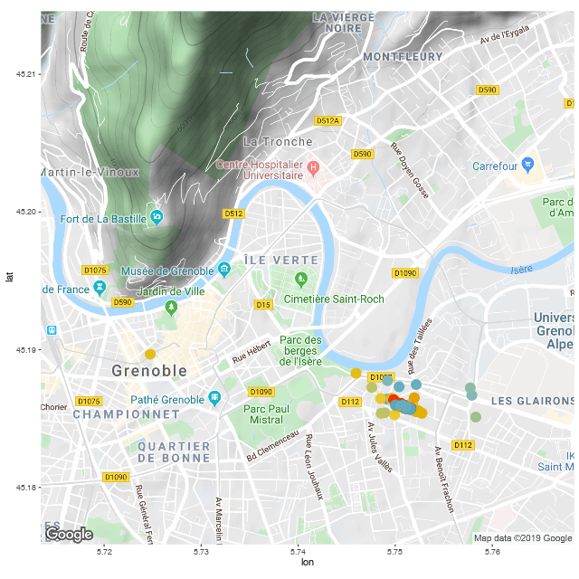

# strava-anim
R script to import your own Strava data and build animated plots with rstrava, ggmap, and gganimate.

# To use:
Clone/download files locally and follow instructions in animated_runs.R. You'll need your own Strava and Google Maps API keys (but they should both be free)
